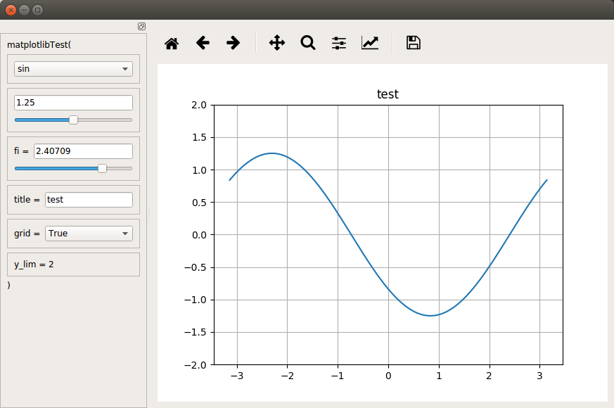
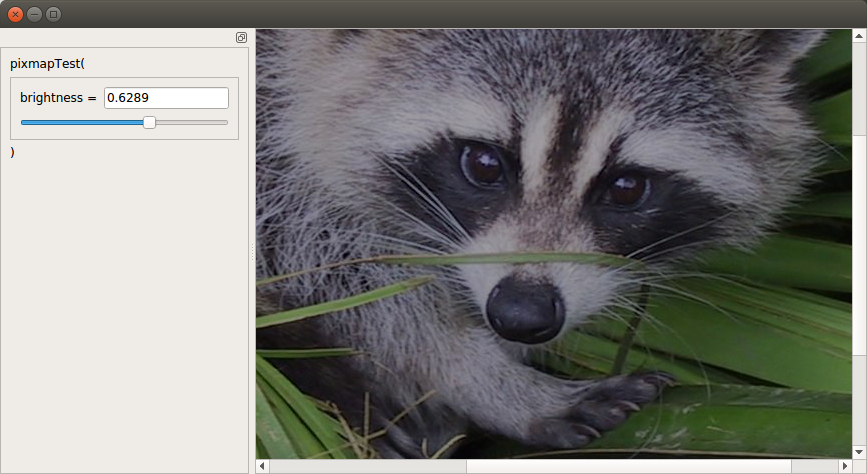
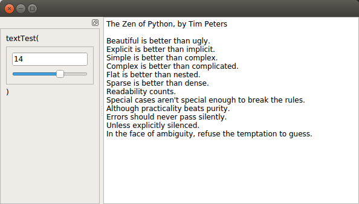

# tunepy
Python decorator which allows to interactively tune arguments of a function using a simple GUI.

Automatically determines output type (matplotlib / numpy image / return value / console output).

## Installation

```
pip install tunepy
```

## Usage

Function decorated with ```@tunepy``` can accept instances of ```tunable``` class as arguments:

```
tunable_argument = tunable(argument_type,
                           definition=definition,
                           listDesc=list_description,
                           ticks=number_of_ticks)
```

where:

- ```arguemnt_type```: one of ```[list, float, int, str, bool]```
- ```definition```: one of the following:
  - ```[lower_bound, upped_bound]``` for ```int``` and ```float```
  - list of arguemnts for ```list```,
  - default string for ```str``` (optional)
- ```list_description```: list of strings to display instead of default, optional for ```list```
- ```number_of_ticks```: number of ticks for a slider bar, optional for ```float``` and ```int```

## Examples
### matplotlib

Note that for decorated function plt.show() is not called.

```python
import matplotlib.pyplot as plt
from tunepy import tunepy, tunable

@tunepy
def matplotlibTest(fun, amp, title='test', fi=0, grid=False, y_lim=2):
    fig, ax = plt.subplots()
    plt.title(title)
    x = np.linspace(-np.pi, np.pi, 1000)
    y = amp*fun(x-fi)
    ax.plot(x,y)
    if grid: ax.grid()
    ax.set_ylim([-y_lim,y_lim])

fun = tunable(list, [np.sin, np.cos], listDesc=['sin', 'cos'])
amp = tunable(float, [0.5,2], ticks=10)
fi = tunable(float, [0, np.pi])
title = tunable(str, 'test')
grid = tunable(bool)
matplotlibTest(fun, amp, fi=fi, title=title, grid=grid, y_lim=2)
```



### numpy image

```python
from scipy import misc
from tunepy import tunepy, tunable

@tunepy
def pixmapTest(brightness=1):
    return misc.face()*brightness

brightness = tunable(float, [0,1])
pixmapTest(brightness=brightness)
```



### text output

```python
import contextlib, io
zen = io.StringIO()
with contextlib.redirect_stdout(zen):
    import this
text = zen.getvalue().splitlines()

@tunepy
def textTest(line):
    return "\n".join(text[:line])

line = tunable(int, [1, len(text)])
textTest(line)
```



## Tips

Output type can be forced by using tunepy\_mode decorator with output type passed as a first argument ("unknown" / "print" / "matplotlib" / "numpyPixmap")
